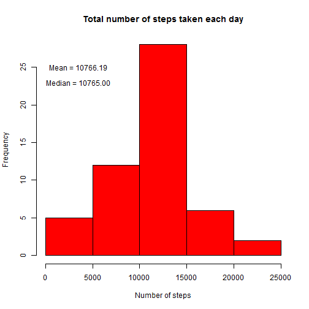
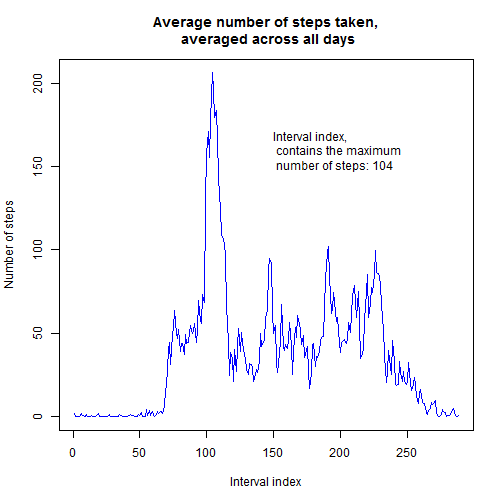
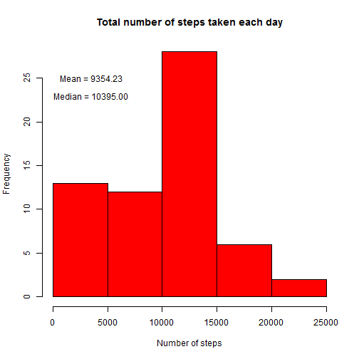
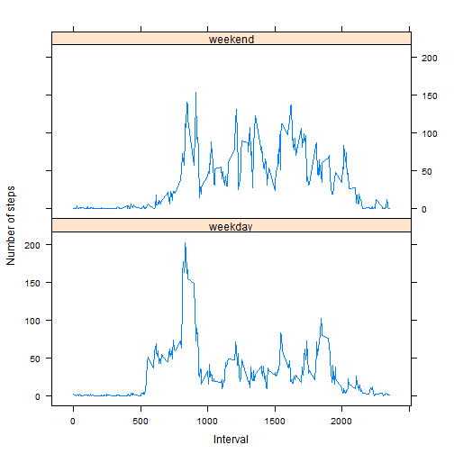

# Reproducible Research: Peer Assessment 1


## Loading and preprocessing the data

```r
d <- read.csv("c:\\RDATA\\activity.csv", header = T, stringsAsFactors = F)
# convert convert character representations of date to objects of class
# 'Date'
d$date <- as.Date(d$date)
```


## What is mean total number of steps taken per day?

```r
# Make a histogram of the total number of steps taken each day. Ignore NA
table.by.day <- aggregate(d$steps[is.na(d$steps) == F], by = list(d$date[is.na(d$steps) == 
    F]), FUN = sum)  # Aggregate steps by day
hist(table.by.day[, 2], col = "red", xlab = "Number of steps", main = "Total number of steps taken each day")
# Report the mean and median total number of steps taken per day
text(c(3500, 3500), c(25, 23), c(sprintf("Mean = %.2f", mean(table.by.day[, 
    2])), sprintf("Median = %.2f", median(table.by.day[, 2]))))
```

 


## What is the average daily activity pattern?

```r
# Aggregate steps by interval
table.by.interval <- aggregate(d$steps, by = list(d$interval), FUN = mean, na.rm = T)
# Make a time series plot of the 5-minute interval (x-axis) and the average
# number of steps taken, averaged across all days (y-axis)
plot(table.by.interval[, 2], type = "l", ylab = "Number of steps", xlab = "Interval index", 
    col = "blue", main = "Average number of steps taken,\n averaged across all days")
# Report 5-minute interval, on average across all the days in the dataset,
# contains the maximum number of steps
text(150, 160, sprintf("Interval index,\n contains the maximum\n number of steps: %i", 
    which(table.by.interval[, 2] == max(table.by.interval[, 2]))), adj = c(0, 
    NA))
```

 


## Imputing missing values

```r
# Calculate and report the total number of missing values in the dataset
sprintf("Total number of missing steps values: %i", nrow(d[is.na(d$steps), ]))
```

```
## [1] "Total number of missing steps values: 2304"
```

```r
# Create a new dataset that is equal to the original dataset but with the
# missing data filled in 0
d2 <- d
d2$steps[is.na(d2$steps)] <- 0
table2.by.day <- aggregate(d2$steps, by = list(d2$date), FUN = sum)  # Aggregate steps by day
hist(table2.by.day[, 2], col = "red", xlab = "Number of steps", main = "Total number of steps taken each day")
# Report the mean and median total number of steps taken per day
text(c(3500, 3500), c(25, 23), c(sprintf("Mean = %.2f", mean(table2.by.day[, 
    2])), sprintf("Median = %.2f", median(table2.by.day[, 2]))))
```

 


## Are there differences in activity patterns between weekdays and weekends?

```r
# Create a new factor variable in the dataset with two levels - 'weekday'
# and 'weekend' indicating whether a given date is a weekday or weekend day.
d2[, 4] <- as.factor(apply(d2, 1, FUN = function(x) if ((weekdays(as.Date(x[2]), 
    abbreviate = T) %in% c("Sat", "Sun"))) {
    "weekend"
} else {
    "weekday"
}))
# Make a panel plot containing a time series plot (i.e. type = 'l') of the
# 5-minute interval (x-axis) and the average number of steps taken, averaged
# across all weekday days or weekend days (y-axis).  Aggregate steps by
# interval
table2.by.interval <- aggregate(d2$steps, by = list(d2$interval, d2$V4), FUN = mean)
# Make a time series plot of the 5-minute interval (x-axis) and the average
# number of steps taken, averaged across all days (y-axis)
names(table2.by.interval) <- c("interval", "weekday.or.weekend", "steps")
library(lattice)
xyplot(table2.by.interval[, 3] ~ table2.by.interval[, 1] | table2.by.interval[, 
    2], type = "l", ylab = "Number of steps", xlab = "Interval", layout = c(1, 
    2))
```

 

